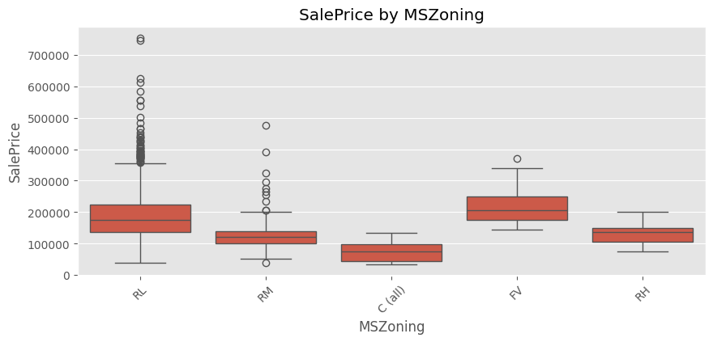
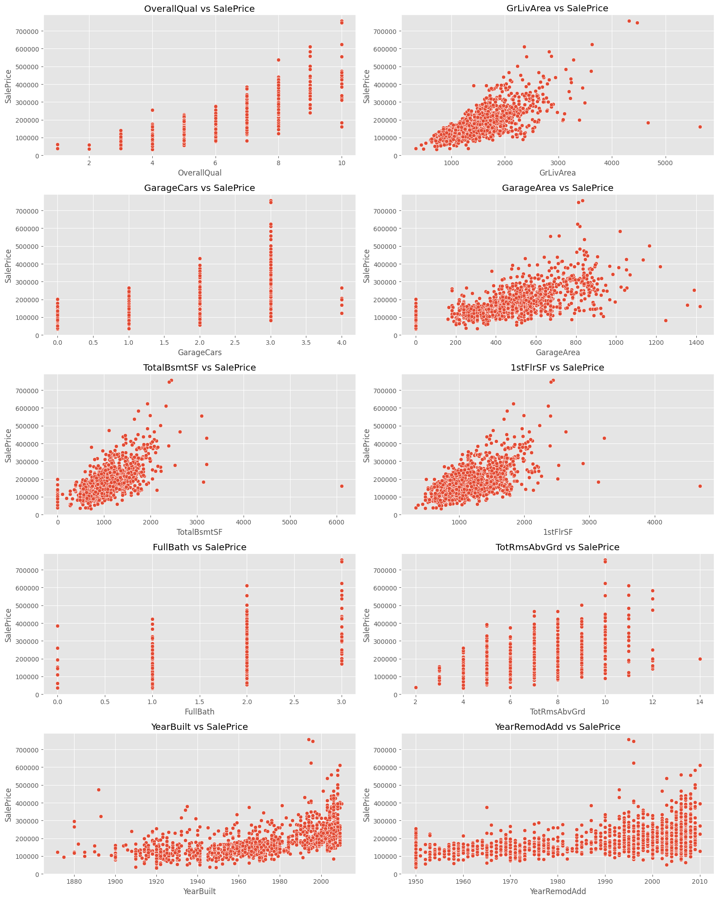
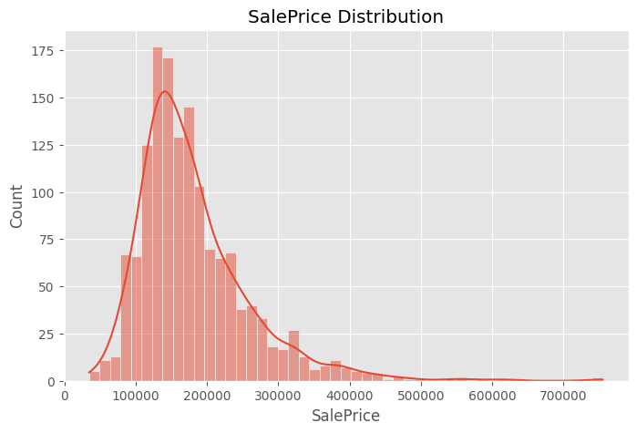

# House Price Prediction

> End-to-end regression system for predicting house prices using structured feature engineering and machine learning models.

---

## 🚀 Overview

This project builds a complete ML regression pipeline using the Kaggle House Prices dataset.

Key stages:

- Data preprocessing
- Feature engineering
- Correlation analysis
- Model training
- Evaluation

Goal: build a **structured and reproducible ML pipeline**, not just a single regression model.

---

## 📊 Data Insights

### Categorical Feature Analysis


### Feature Correlation Heatmap


### Target Distribution (Log Scale)


### Target Distribution (Original)


### Top Correlated Features


---

## 🧠 Feature Engineering

Key predictive features:

- OverallQual (material quality)
- GrLivArea (living area)
- GarageCars / GarageArea
- TotalBsmtSF
- First Floor Area
- FullBath
- Total Rooms
- YearBuilt / YearRemodAdd
- Categorical encoding (Neighborhood, MSZoning)

Core idea: **transform raw housing data into structured predictive signals**

---

## ⚙️ System Pipeline

```
Raw Data
   ↓
Data Cleaning
   ↓
Feature Engineering
   ↓
Encoding & Scaling
   ↓
Model Training
   ↓
Evaluation
```

Pipeline steps:
- Missing value imputation (median / mode)
- One-hot encoding
- Feature scaling (StandardScaler)
- Regression modeling

---

## 🤖 Models

- Linear Regression (baseline)
- Improved regression model

---

## 📈 Results

- RMSE: ~32000
- MAE: ~20000
- R² Score: ~0.83

Key insights:
- Log transform improves prediction stability
- Feature engineering > model complexity
- Strong correlation features dominate prediction

---

## 📁 Project Structure

```
house-price-prediction/
│
├── data/
├── models/
├── assets/
│   ├── cat.png
│   ├── corr.png
│   ├── Log_Distribution.png
│   ├── SalePrice_Distribution.png
│   └── Top_Correlated_Features.png
│
├── src/
│   ├── train.py
│   ├── predict.py
│   └── evaluate.py
│
└── README.md
```

---

## ▶️ How to Run

### Install dependencies
```bash
pip install -r requirements.txt
```

### Train model
```bash
python src/train.py
```

### Run inference
```bash
python src/predict.py
```

---

## 🧩 Key Concepts

- Feature engineering is more important than model complexity
- Log transformation stabilizes target distribution
- Correlation analysis guides feature selection
- Structured pipeline improves reproducibility

---

## 🔮 Future Work

- Try XGBoost / LightGBM
- Hyperparameter tuning (GridSearchCV)
- Automated feature selection
- Web deployment (Streamlit dashboard)
- Model comparison system

---

## 👤 Author

Built by: Hubert Kuo  
Focus: Machine Learning / AI Systems