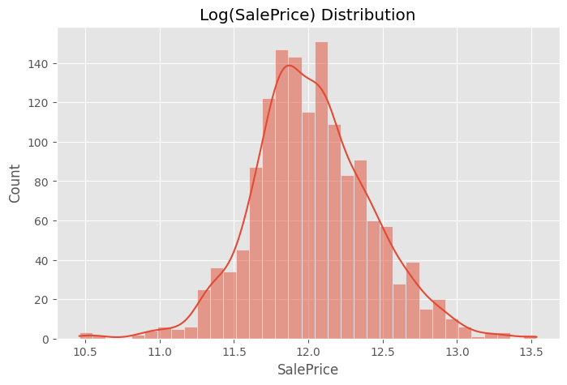
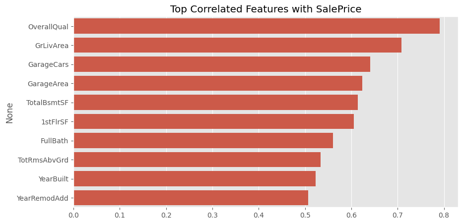

# House Price Prediction (Machine Learning Project)

A regression project for predicting house prices using feature engineering and linear + machine learning models.

---

## Project Overview

This project explores the Kaggle House Prices dataset and builds a baseline + improved regression pipeline using:

- Data preprocessing
- Feature selection
- Correlation analysis
- Machine learning regression models
- Model evaluation (RMSE / MAE / R²)

---

## Dataset Analysis

### Categorical Feature Insight


---

### Correlation Heatmap


---

### Target Distribution (Log Scale)



---

### Target Distribution (Original)


---

### Top Correlated Features



---

## Feature Engineering

Key features used in the final model:

- OverallQual
- GrLivArea
- GarageCars
- GarageArea
- TotalBsmtSF
- 1stFlrSF
- FullBath
- TotRmsAbvGrd
- YearBuilt
- YearRemodAdd
- MSZoning
- Neighborhood
- HouseStyle
- Exterior1st
- KitchenQual

---

## Model Pipeline

- Missing value imputation (median / most frequent)
- Standardization (StandardScaler)
- One-hot encoding for categorical features
- Linear Regression / baseline model

---

## Evaluation Metrics

- RMSE: ~32000
- MAE: ~20000
- R²: ~0.83

---

## Project Structure

```
house-price-prediction-ml/
├── data/
├── models/
├── assets/
├── src/
│   ├── train.py
│   ├── predict.py
│   ├── evaluate.py
├── notebooks/
└── README.md
```

---

## How to Run

### 1. Install dependencies
```bash
pip install -r requirements.txt
```

### 2. Train model
```bash
python src/train.py
```

### 3. Run prediction
```bash
python src/predict.py
```


---

## Key Insight

- OverallQual and GrLivArea are the strongest predictors
- Model performance is stable with R² ≈ 0.83
- Log transformation improves distribution stability

---

##  Author

HubertKuo

---

## Notes

This project is part of a machine learning portfolio for internship applications.

